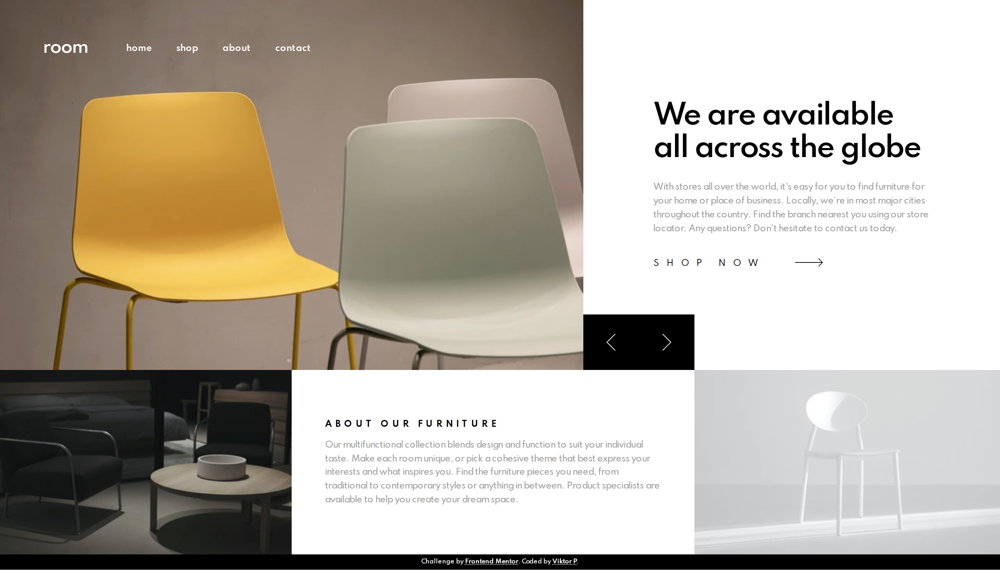
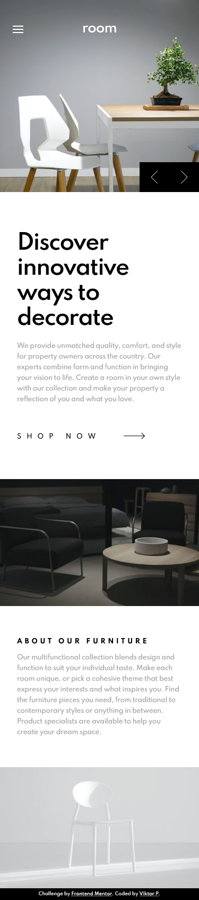

# Frontend Mentor - Room homepage solution

This is a solution to the [Room homepage challenge on Frontend Mentor](https://www.frontendmentor.io/challenges/room-homepage-BtdBY_ENq). Frontend Mentor challenges help you improve your coding skills by building realistic projects. 

## Table of contents

- [Overview](#overview)
  - [The challenge](#the-challenge)
  - [Screenshot](#screenshot)
  - [Links](#links)
- [My process](#my-process)
  - [Built with](#built-with)
  - [Useful resources](#useful-resources)
- [Author](#author)

## Overview

### The challenge

Users should be able to:

- View the optimal layout for the site depending on their device's screen size
- See hover states for all interactive elements on the page
- Navigate the slider using either their mouse/trackpad or keyboard

### Screenshot

### Links

- Solution URL: (https://room-homepage-gamma.vercel.app/)
- Live Site URL: (https://github.com/Umlen/room-homepage)

## My process

### Built with

- HTML5
- SCSS
- Flexbox
- JavaScript

### Useful resources

- https://learn.javascript.ru/ - This helped me with JavaScriptuse it going forward.

## Author

- GitHub - [Viktor](https://github.com/Umlen)
- Frontend Mentor - [@Umlen](https://www.frontendmentor.io/profile/Umlen)